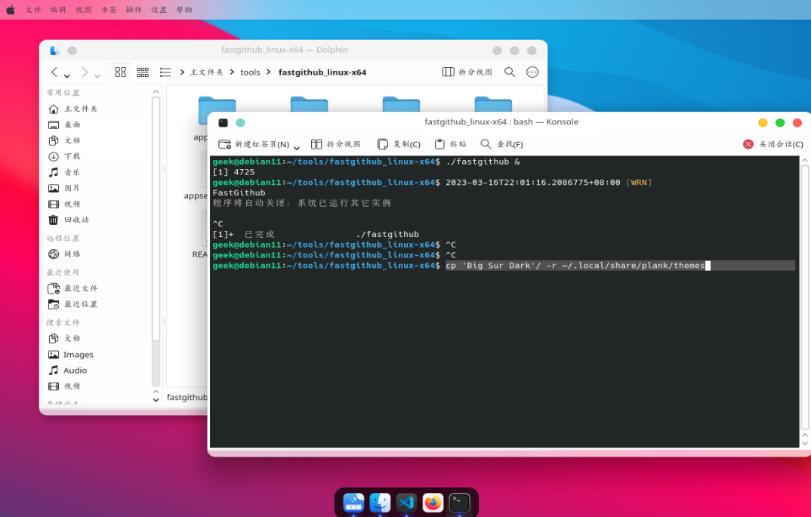
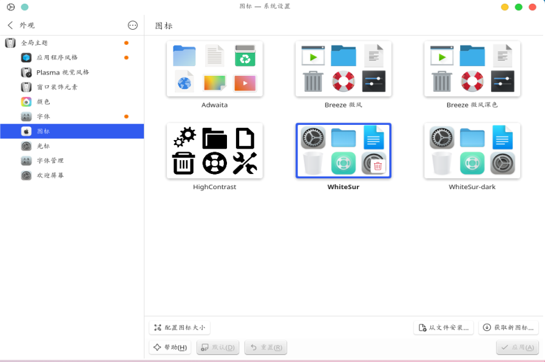

!!! note
    通过安装Whitesur主题，让你的linux看起来非常炫酷。
<!--more-->

## whiteSur 主题

主题下载地址 [WhiteSur-gtk-theme](https://github.com/vinceliuice/WhiteSur-gtk-theme)  

### 预览效果



## 安装主题

解压后在终端中执行执行`./install`即可。

## 安装icons

下载地址 ：https://github.com/vinceliuice/WhiteSur-icon-theme
上面的地址下载后 图标显示不全，使用下面的地址即可解决问题。
下载的时候下载：https://github.com/vinceliuice/WhiteSur-icon-theme/archive/refs/tags/2022-08-30.tar.gz
安装方法，解压后 `./install`，非常简单。



## 安装plank dock栏

安装Plank
plank的安装非常简单：
```bash
sudo apt install plank
```
> plank主题地址
地址1：https://www.gnome-look.org/p/1399398/
github地址：[下载地址](https://github.com/x64Bits/plank-themes)
> 使用方法：
解压后，在终端打开，复制主题文件夹到plank主题目录。
```bash
cp 'Big Sur Dark'/ -r ~/.local/share/plank/themes
```
启动plank:  `plank &`

## linux添加自启动
为了每次启动能够正常使用plank,将plank添加到 linux自启动程序中。

开机启动：
1、跳转到对应位置（/etc/init.d/）
```bash
cd /etc/init.d/
```

2、创建sh脚本（文本名.sh）（如果不存在会自动创建）
```bash
sudo gedite /etc/init.d/my-starter.sh
```

3、在sh文件中输入一下内容

```bash
  #!/bin/sh
    
    ### BEGIN INIT INFO
    # Provides:Leanote
    # Required-Start: $network $remote_fs $local_fs
    # Required-Stop: $network $remote_fs $local_fs
    # Default-Start: 2 3 4 5
    # Default-Stop: 0 1 6
    # Short-Description: Leanote
    # Description: Leanote start
    ### END INIT INFO
    
    #开机启动 plank &
    nohup plank &

    exit 0
```